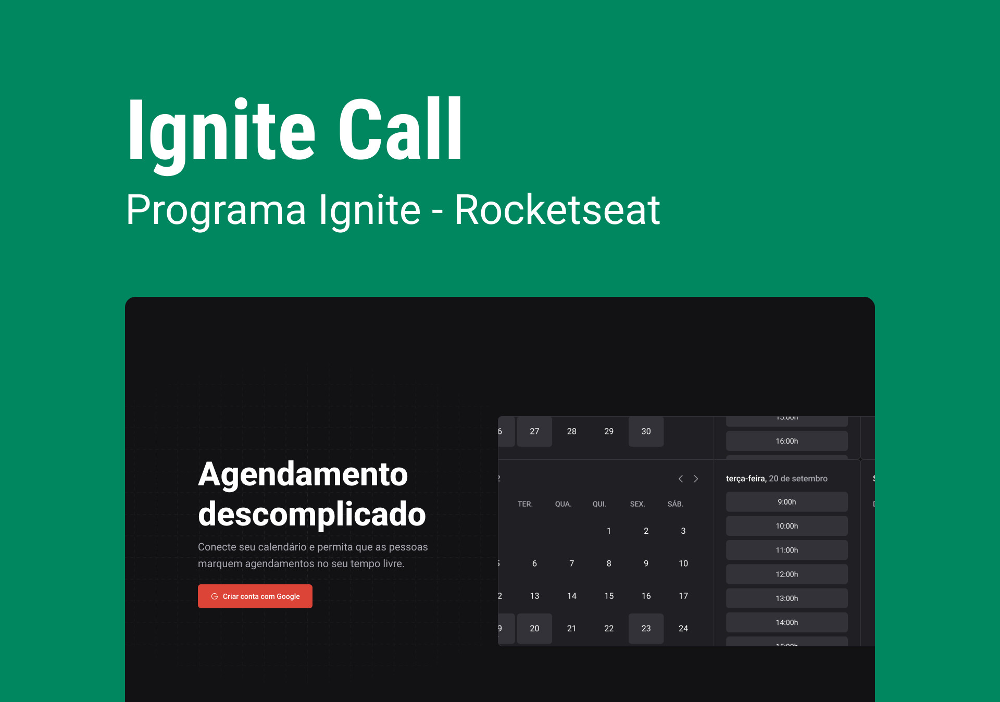

<h1 align="center">
    
</h1>

<br>


## 🚀 Como executar

Clone o projeto e acesse a pasta do mesmo.

```bash
$ git clone https://github.com/jrxr/ignite-call.git
$ cd ignite-call
```

Para iniciá-lo, siga os passos abaixo:
```bash
# Instalar as dependências
$ npm install
# Iniciar o projeto
$ npm run dev 
```
O app estará disponível no seu browser.

## 💻 Projeto

Ignite Call e um programa de agendamento descomplicado que conecta seu calendário e permite que as pessoas marquem agendamentos no seu tempo disponível.

## 🔖 Layout

Você pode visualizar o layout do projeto através do link abaixo:

- [Layout Web](https://www.figma.com/file/qBaR98DFogDQ5H0xOFpjhZ/Ignite-Call-(Community)?node-id=339%3A77&t=D20OYC7MObnYhqLY-0)

Lembrando que você precisa ter uma conta no [Figma](http://figma.com/).

## 📝 License

Esse projeto está sob a licença MIT. Veja o arquivo [LICENSE](LICENSE.md) para mais detalhes.

---

Feito com 💜 by Agacy Júnior 💻